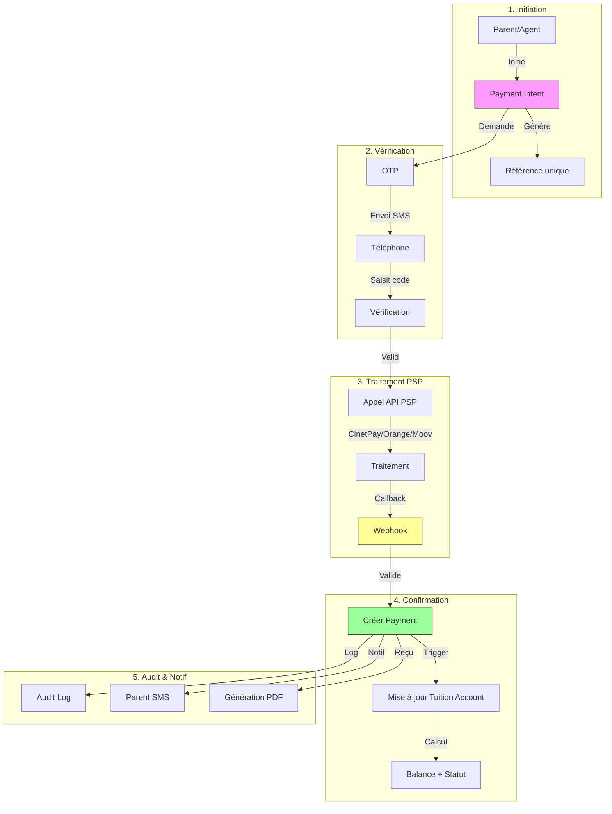
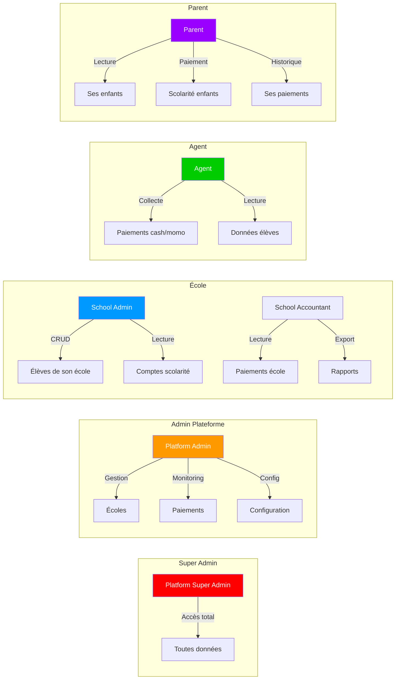
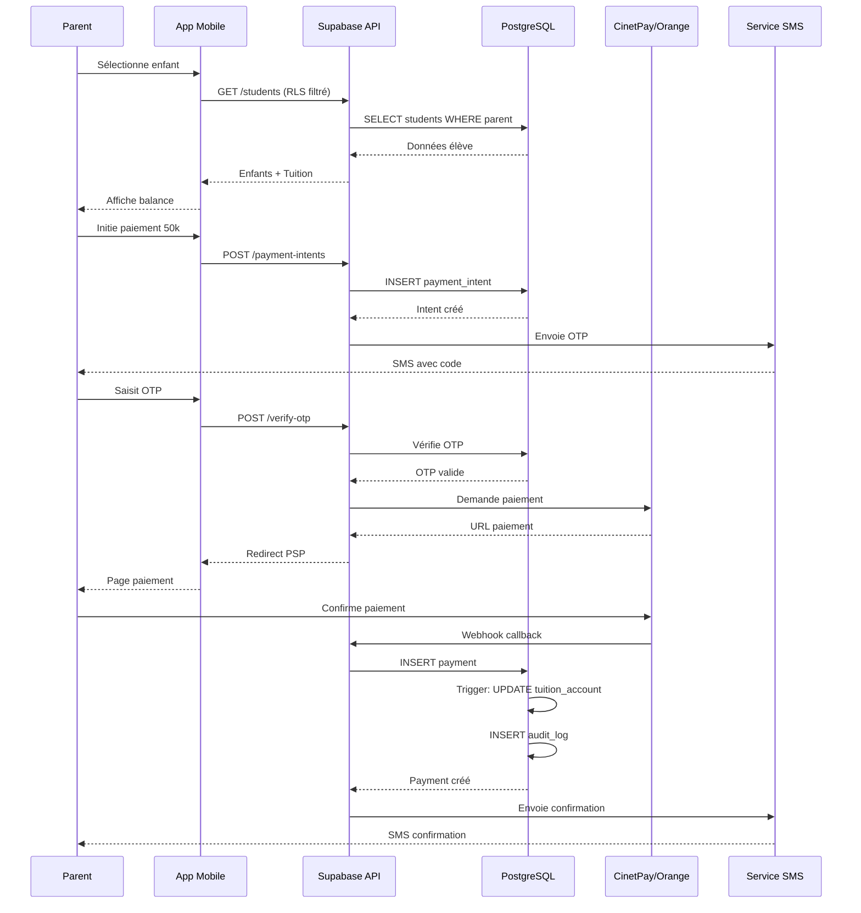
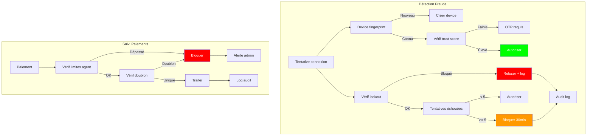
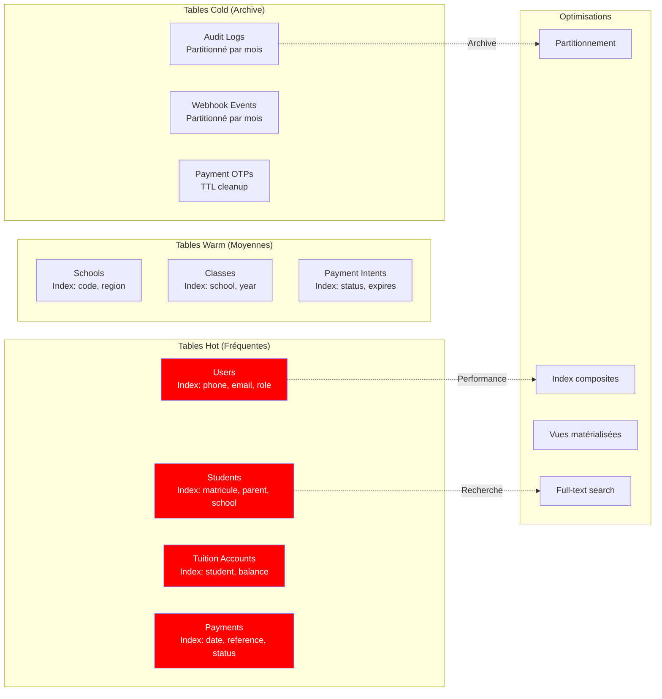
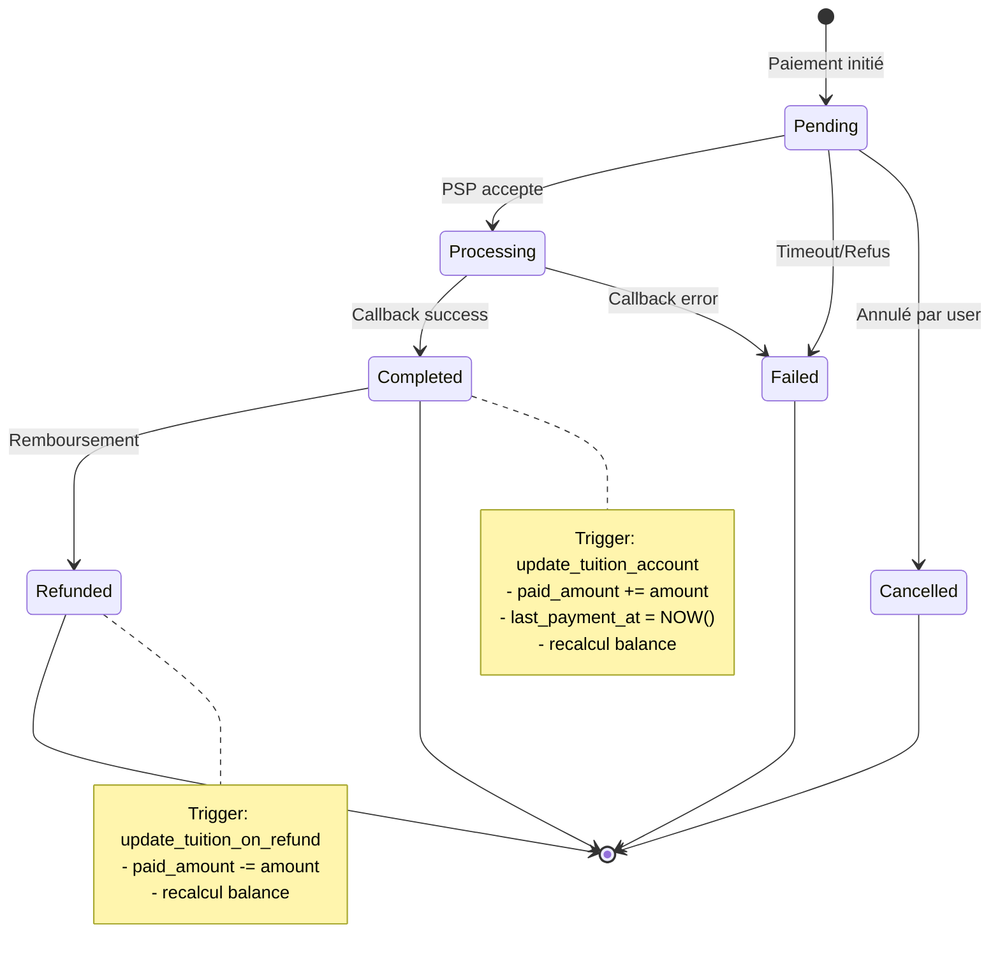
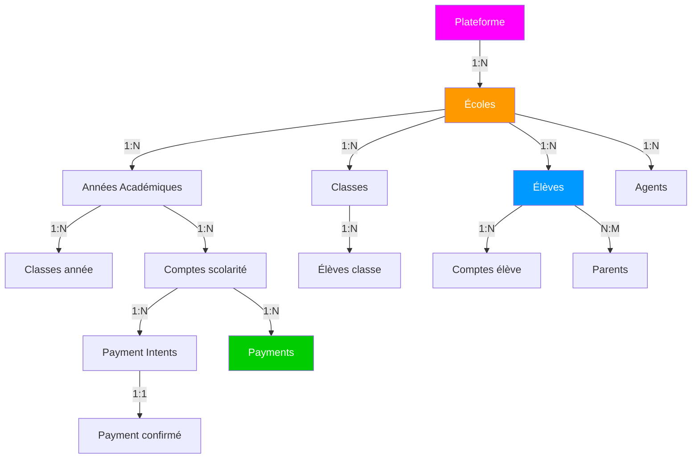
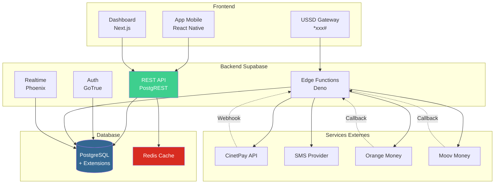

# 📐 DIAGRAMME ENTITÉ-RELATION - SYSTÈME SCOLARITÉ BF

## Diagramme principal (Mermaid ERD)

```mermaid
erDiagram
    USERS ||--o{ SCHOOLS : "administre"
    USERS ||--o{ AGENTS : "est_agent"
    USERS ||--o{ PARENT_STUDENTS : "est_parent"
    USERS ||--o{ PAYMENT_INTENTS : "initie"
    USERS ||--o{ PAYMENTS : "effectue"
    USERS ||--o{ DEVICES : "utilise"

    SCHOOLS ||--o{ ACADEMIC_YEARS : "contient"
    SCHOOLS ||--o{ CLASSES : "offre"
    SCHOOLS ||--o{ STUDENTS : "inscrit"
    SCHOOLS ||--o{ AGENTS : "emploie"

    ACADEMIC_YEARS ||--o{ CLASSES : "organise"
    ACADEMIC_YEARS ||--o{ TUITION_ACCOUNTS : "concerne"

    CLASSES ||--o{ STUDENTS : "regroupe"

    STUDENTS ||--o{ TUITION_ACCOUNTS : "possède"
    STUDENTS ||--o{ PARENT_STUDENTS : "lié_à"

    TUITION_ACCOUNTS ||--o{ PAYMENT_INTENTS : "pour"
    TUITION_ACCOUNTS ||--o{ PAYMENTS : "paye"

    PAYMENT_INTENTS ||--o| PAYMENTS : "devient"
    PAYMENT_INTENTS ||--o{ PAYMENT_OTPS : "nécessite"

    WEBHOOK_EVENTS ||--o| PAYMENT_INTENTS : "concerne"
    WEBHOOK_EVENTS ||--o| PAYMENTS : "confirme"

    USERS {
        uuid id PK
        varchar phone UK
        varchar email UK
        varchar first_name
        varchar last_name
        varchar display_name
        user_role role
        boolean is_active
        timestamptz created_at
    }

    SCHOOLS {
        uuid id PK
        varchar code UK
        varchar name
        varchar region
        uuid admin_user_id FK
        decimal commission_rate
        int commission_fixed
        boolean is_active
    }

    ACADEMIC_YEARS {
        uuid id PK
        uuid school_id FK
        varchar label
        date start_date
        date end_date
        academic_year_status status
        boolean is_current
    }

    CLASSES {
        uuid id PK
        uuid school_id FK
        uuid academic_year_id FK
        varchar name
        int tuition_amount
        boolean allow_installments
        int min_installment_amount
    }

    STUDENTS {
        uuid id PK
        uuid school_id FK
        uuid class_id FK
        varchar matricule
        varchar first_name
        varchar last_name
        varchar display_name
        date date_of_birth
        char gender
        uuid parent_user_id FK
        varchar parent_phone
        boolean is_active
    }

    TUITION_ACCOUNTS {
        uuid id PK
        uuid student_id FK
        uuid academic_year_id FK
        int total_amount
        int paid_amount
        int balance
        boolean is_fully_paid
        timestamptz last_payment_at
    }

    PAYMENT_INTENTS {
        uuid id PK
        varchar reference UK
        uuid tuition_account_id FK
        uuid initiated_by FK
        int amount
        payment_channel channel
        payment_provider provider
        payment_status status
        timestamptz expires_at
    }

    PAYMENTS {
        uuid id PK
        varchar reference UK
        uuid tuition_account_id FK
        uuid payment_intent_id FK
        uuid paid_by FK
        int amount
        int commission_amount
        int net_amount
        payment_channel channel
        payment_provider provider
        payment_status status
        timestamptz created_at
    }

    AGENTS {
        uuid id PK
        uuid user_id FK UK
        uuid school_id FK
        varchar agent_code UK
        int daily_limit
        int transaction_limit
        boolean is_active
    }

    PARENT_STUDENTS {
        uuid id PK
        uuid parent_user_id FK
        uuid student_id FK
        varchar relationship
        boolean is_primary
        boolean can_make_payments
    }

    PAYMENT_OTPS {
        uuid id PK
        uuid user_id FK
        varchar phone
        varchar otp_hash
        otp_purpose purpose
        uuid payment_intent_id FK
        timestamptz expires_at
        boolean is_used
    }

    WEBHOOK_EVENTS {
        uuid id PK
        payment_provider provider
        varchar event_type
        varchar idempotency_key UK
        jsonb raw_payload
        webhook_status status
        uuid payment_intent_id FK
        uuid payment_id FK
    }

    AUDIT_LOGS {
        uuid id PK
        uuid user_id FK
        audit_action action
        varchar resource_type
        uuid resource_id
        jsonb old_values
        jsonb new_values
        timestamptz created_at
    }

    DEVICES {
        uuid id PK
        uuid user_id FK
        varchar device_id
        varchar platform
        boolean is_trusted
        int trust_score
        timestamptz last_used_at
    }
```

---

## Diagramme des flux de paiement



---

## Diagramme des rôles et permissions



---

## Flux de données principal



---

## Architecture de sécurité (RLS)

```mermaid
graph TD
    subgraph "Row Level Security"
        REQ[Requête SQL]
        REQ -->|auth.uid()| CHECKUSER[Vérif utilisateur]
        CHECKUSER -->|auth.user_role()| CHECKROLE[Vérif rôle]
        CHECKROLE -->|Policies| FILTER[Filtrage RLS]

        FILTER -->|Parent| FILTERP[Ses enfants seulement]
        FILTER -->|School Admin| FILTERS[Son école seulement]
        FILTER -->|Agent| FILTERA[École agent + saisies]
        FILTER -->|Platform Admin| FILTERNONE[Aucun filtre]

        FILTERP --> RESULT[Résultat filtré]
        FILTERS --> RESULT
        FILTERA --> RESULT
        FILTERNONE --> RESULT
    end

    style CHECKUSER fill:#f9f
    style CHECKROLE fill:#ff9
    style RESULT fill:#9f9
```

---

## Schéma anti-fraude



---

## Modèle de données optimisé



---

## Cycle de vie d'un paiement



---

## Hiérarchie des données



---

## Diagramme de déploiement



---

## Légende des symboles

### Relations
- `||--o{` : Un à plusieurs (1:N)
- `||--||` : Un à un (1:1)
- `}o--o{` : Plusieurs à plusieurs (N:M)
- `-->` : Dépendance / Flux
- `-.->` : Lien faible / Optionnel

### Types de clés
- `PK` : Primary Key (Clé primaire)
- `FK` : Foreign Key (Clé étrangère)
- `UK` : Unique Key (Contrainte d'unicité)

### Couleurs
- 🔴 Rouge : Tables critiques / haute fréquence
- 🟠 Orange : Tables importantes / fréquence moyenne
- 🟢 Vert : Succès / Validation
- 🔵 Bleu : Information / Lecture
- 🟣 Violet : Administration / Config

---

**Utilisation:** Ces diagrammes peuvent être visualisés avec des outils compatibles Mermaid (GitHub, GitLab, VS Code, etc.)
